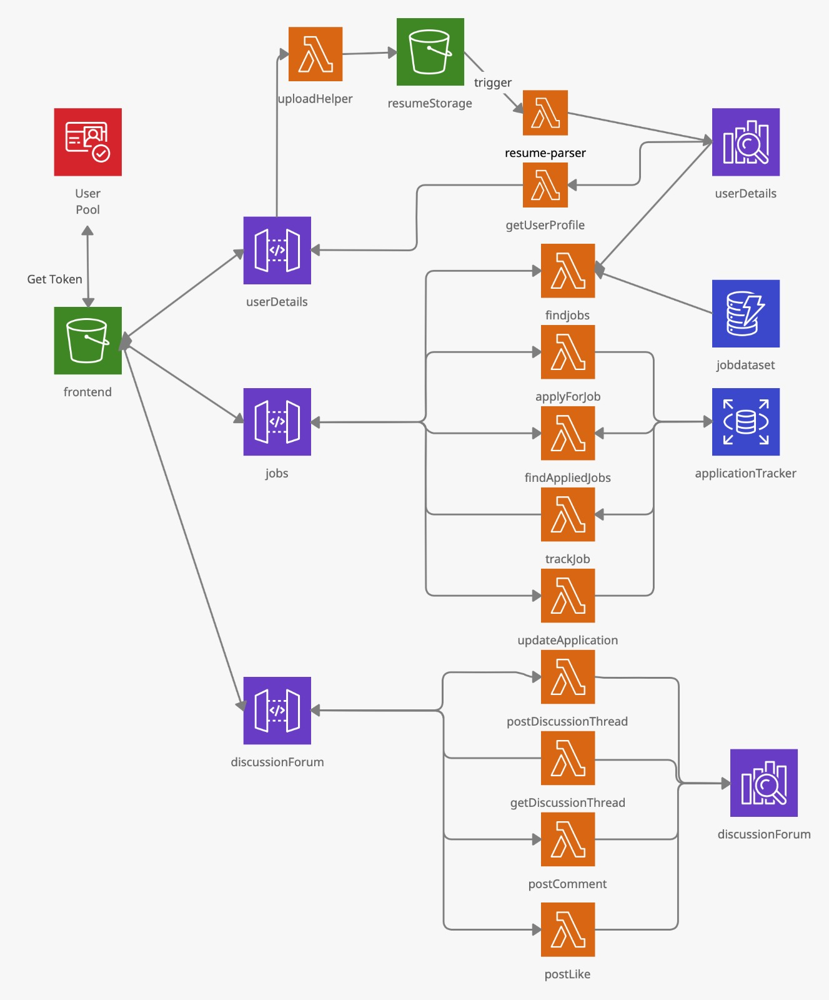

Project Name-: CareerConnect

Team Members-:
Divya Gupta(dg3483)
Viren Parmar(vmp2018)
Niteesha Thottempudi(nt2306)
Venkata Vyshnavi Ravella(vr2226)

Project description-:

The main focus of this project is to leverage amazon cloud technologies to build fast and scalable web applications where people from all professional walks of life can easily connect with experts in their respective fields and with people with similar skill sets. We will explore and implement different ways to recommend such people based on the individual profile so that they don’t need to spend time searching for them. Besides this, they will get job recommendations based on their skill sets and additional skills they need for the particular job they have applied for.

Motivation-:

The motivation of this project is to connect people with experts and people with similar skills and interests without the hassle of searching for them ourselves. They will get recommendations of such people on their profile from time to time by our website. 

Product features-:

User profile creation.
Job recommendations.
People recommendation
Discussion Forum
Job Application tracker

Data Source-: 

We will use data from Kaggle.
 https://www.kaggle.com/gauravduttakiit/resume-dataset 
 https://www.kaggle.com/atharvap329/glassdoor-eda/data
 
Existing Products-:
Indeed
Linkedin

Architecture Diagram:

Clickable Prototype:
https://sites.google.com/view/careerconnect

MVP: 
Link: https://youtu.be/IsX6h7OIIQk 
Final Demo: 
Link: https://youtu.be/VYDpNQstYYk
Presentation:
https://docs.google.com/presentation/d/1lKvwdzgdAEvxtLmBqAvJzV9iRkasSTfqpN4CHBMA5Gw/edit?usp=sharing

Description:
In our application we have AWS Cognito for user signup and sign in. In the registration page, User needs to provide Email Id, Given Name and Password as required fields. After Registering, User needs to sign in and he is redirected to the profile page. In profile page users need to upload his/her resume. 

We have used https://www.kaggle.com/gauravduttakiit/resume-dataset data set to get the around 1300 skills key word for job tilles that includes “Data Science”, “Web designer”, “Java developer”, “ML engineer”,”Python Developer”, “Network Security engineer”, “Database developer”, “DevOps engineer”, “Dot Net Developer'', “ETL Developer”, “Sap Developer”, “Automation Engineer'', “TesT Engineer''. We have manually cleaned this data and used spark to remove duplicates and structure it so that it can be saved in the DynamoDB Table.  Once we get the resume in “resumeparsingdata” S3 bucket, resume-parser lambda function gets triggered. Here we are converting PDF file to text file using PDF Minner libraries. And Extracting Personal details like resume email, phone number on resume, education details and skills mentioned in resume after matching it with the keywords in dynamoDB Table. We are getting username and user logged in email ID from cognito using access token. All this information is getting indexed in open search. 

To see all the people with similar skill sets, users need to go to Connect Tab. Here They will be able to see other user names, email id and no skills Matched with him/her. In this we have extracted all the user data from open search and taken Intersection of skills list from the user list in findSimilarUsers lambda function. 

On the ‘Find Job’ tab, we recommend jobs to users. We are matching user skills with all the skills extracted from the job description and displaying the job title and salary(for MVP) (Lambda Function:findJobs). The skills required for a particular job is extracted using the same logic that we are using to extract user skills from resumes. 
We are using a dataset of jobs from kaggle (https://www.kaggle.com/atharvap329/glassdoor-eda/data).

On the discussion forum tab, we have provided each individual user the ability to create posts. They will be able to see all the lists of Discussion threads on the same page. They can comment and like some posts as well.

On the Application tracker tab users can see the list of jobs they have applied to and that application history. Users can also update the status as he/she progresses with some applications to keep the track.  
